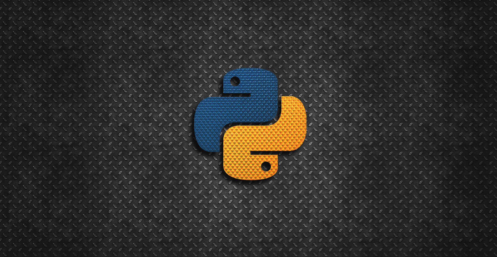

# 👋 Hi there, I'm Baptiste  

🎯 I'm a **French junior developer** specialized in **Data Science** and **AI/ML model engineering**.  
I'm passionate about data, machine learning, and building intelligent systems.

---

## 🧠 About Me
- 🇫🇷 Based in France  
- 🎓 Background in Data Science / AI / Software Development  
- 💡 Interested in: Machine Learning, Deep Learning, MLOps, NLP, and Computer Vision  
- 🧰 Main stack: Python, TensorFlow, scikit-learn, pandas, Docker, SQL  
- 🌱 Currently learning more about **Neural Networks** (CNNs, RNNs, etc.), **LLM engineering**, and **Streamlit** for deploying AI models as web apps  

---

## 🚀 Recent Projects
- 🧠 [**BrainIRM_Classifier**](https://github.com/db200253/BrainIRM_Classifier) — Brain tumor classification using transfer learning  
- 🔢 [**MLPForMNIST**](https://github.com/db200253/MLPForMNIST) — MNIST image classification using a multilayer perceptron built from scratch  
- ⛵ [**TitanicSurvivor**](https://github.com/db200253/TitanicSurvivor) — Survivor prediction using the classic Titanic dataset from Kaggle  

---

## 🛠️ Tech Skills
| Area | Tools & Technologies |
|------|----------------------|
| Data Science | pandas, NumPy, scikit-learn |
| Deep Learning | TensorFlow, Keras |
| Deployment | Docker, Streamlit |
| Version Control | Git, GitHub |

---

## 📫 Get in Touch
- 💼 [LinkedIn](https://www.linkedin.com/in/baptiste-duvieu)

---

⭐️ Feel free to explore my repositories, contribute, or reach out — I love discussing AI, Data Science, and all things tech!
