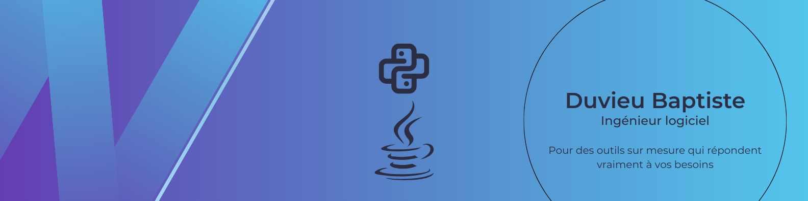

# 👋 Hi there, I'm Baptiste  

🎯 **Junior Frontend Developer** focused on building clean interfaces. I love creating things that look good and feel smooth !

---

## 🧠 About Me
- 🇫🇷 Based in France  
- 🎨 Passionate about UI/UX, design systems & component architecture
- 🧰 Main stack: React, Next.js, TypeScript, Tailwind CSS

---

## 🚀 Recent Projects
***Coming soon...***

---

## 🛠️ Tech Skills
| Area | Tools & Technologies |
|------|----------------------|
| Frontend | React, Next.js, TypeScript |
| UI / Styling | Tailwind CSS, shadcn/ui, Framer Motion |
| Design | Figma|
| State Management | Redux Toolkit |
| Testing | Jest |
| DevOps / Deployment | Docker, Vercel |

---

## 📫 Get in Touch
- 💼 [LinkedIn](https://www.linkedin.com/in/baptiste-duvieu)

---

⭐️ Feel free to explore my repositories, contribute, or reach out !
