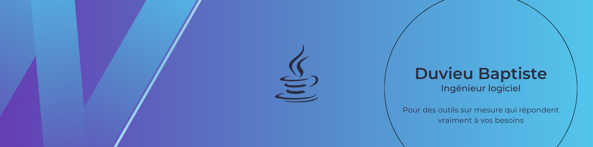

# 👋 Hi there, I'm Baptiste  

🎯 **Software engineer** focused on building reliable software with a focus on performance and maintainability.

---

## 🧠 About Me
- 🇫🇷 Based in France  
- 🎨 Passionate about API design, distributed systems, and clean architecture
- 🧰 Main stack: Java Spring Boot and Python Django

---

## 🚀 Recent Projects
***Coming soon...***

---

## 🛠️ Tech Skills
| Area | Tools & Technologies |
|------|----------------------|
| Backend | Django, Spring Boot |
| API & Architecture | REST, Microservices |
| Databases | PostgreSQL, MySQL |
| Backend Testing | JUnit, PyTest |

---

## 📫 Get in Touch
- 💼 [LinkedIn](https://www.linkedin.com/in/baptiste-duvieu)

---

⭐️ Feel free to explore my repositories, contribute, or reach out !
